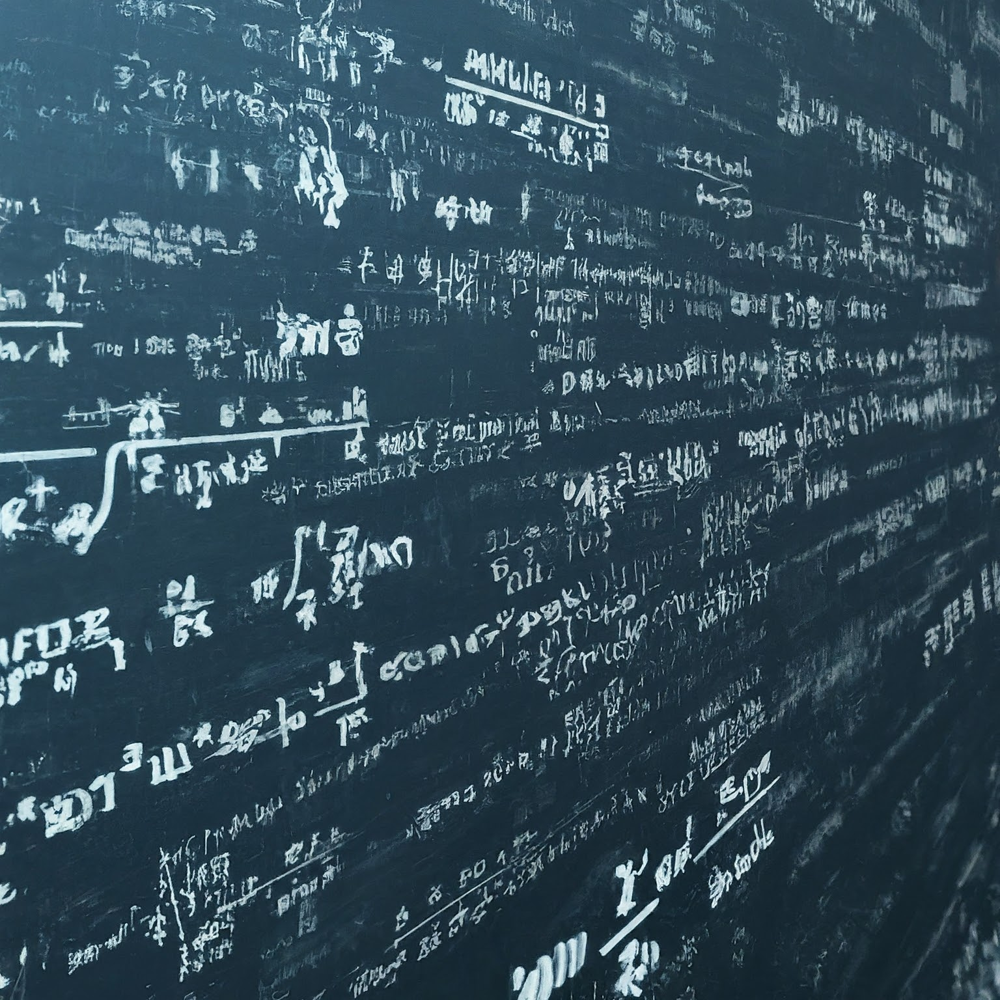

<!-- theme: default -->
<!-- auto-scaling: true -->

# <!-- fit --> MATH 2740 Mathematics of Data Science

# Some information about the course (Fall 2024)

Julien Arino ([julien.arino@umanitoba.ca](mailto:julien.arino@umanitoba.ca))

Department of Mathematics
University of Manitoba

---

# Foreword

- "Numerical dates" are in the form YYYY-MM-DD (e.g, today is 2024-09-05)
- Times are 24h (HHMM)
- Units are SI

In case you want to know, some of the slides in the course are html5 generated from `markdown` files using [marp](https://marp.app/). Others are pure $\LaTeX$. All (including source code) are available on GitHub [here](https://github.com/julien-arino/math2740-of-data-science)

---

# Getting in touch

- [julien.arino@umanitoba.ca](mailto:julien.arino@umanitoba.ca)

- Please use your `myumanitoba` email address. Use a tag such as `[MATH 2740]` in your subject line, if you want to be read..

- There's an entry in the university address book with a phone for me.. don't bother: we don't have office phones anymore! (It will just take several years for this to be reflected in the address book)

---

# Office hours

- Because of the ongoing renovation of Machray Hall, I am sharing an office with 8 other colleagues. Next door are offices shared by another 8 and 4 colleagues

- It is therefore not possible for me to see you in my office

- I have booked 236 St Paul's College from 1600 to 1700 on Tuesday and Thursday for office hours

---

# Course website - UMLearn

- All information about the course is posted on UMLearn

- It is **your responsibility** to check the UMLearn site regularly: *Announcements* is how I normally communicate with you about the course

- (Remember to hit the link at the top of the page that says *MATH-2740-A01 - Mathematics of Data Science*, sometimes UMLearn takes you directly to Content, which is not where Announcements are)

---

# Lectures

- TR 1130-1245 in 204 Armes

- Videos for the course as I taught it in 2021 are available on as a [YouTube playlist](https://www.youtube.com/playlist?list=PLfRaznSpWo2vQAn1jVyueTuAiryDaxkH3). There is no guarantee that that the content will be the same this year, but there will be commonalities for sure

---

# Tutorials

- It is strongly recommended to attend tutorials, as this is where you will review some of the mathematical content

- Tutorials are as follows

| Section | Day and time | Location |
|---------|--------------|----------|
| B01 | W 0830-0920 | 301 Biological Sciences |
| B02 | W 0930-1020 | 301 Biological Sciences |
| B03 | W 1130-1220 | 301 Biological Sciences |

---

# Evaluation through assignments only
- Evaluation is through assignments only (no tests, no final examination!)
- One assignment per week (posted Friday at 1200, due the following Friday at 1200, except Friday before reading week, which is due the Friday after reading week)
- Assignments will be mathematical OR (not XOR) computational. If both, (assignment complete $\iff$ **both** parts are handed back)
- The mark will consist of the average of the marks on the **best 10** assignments
- In the mathematical part, it is possible that not all questions will be marked. If you do not submit an answer to a question that is marked, you will receive **zero** for that question
- There will be **no** tolerance for late assignments and there will not be any make-up for missed assignments: any assignment not returned by the deadline will result in a mark of **zero**

---

# Self-declaration of absences

- You can self-declare an absence of less than 120 hours (5 days) instead of providing a doctor's note

- If a self-declared absence overlaps with the due date and time of Friday at 1200
    - submit the [form](https://forms.office.com/r/HSXE50PefN) **prior** to the deadline
    - This modifies *your* deadline for *that* assignment

- **I will not accept self-declarations after the deadline**: if at 1200 Friday, I have not received a self-declaration form XOR the assignment, you get a mark of zero on that assignment

- Self-declarations are intended for very occasional and unforeseen circumstances $\implies$ I **will not accept more than two** during the term 

---

# Returning assignments (mathematics part)

- The mathematical part of the assignment goes to Crowdmark
    - Ensure legibility
    - Answer questions in order
    - Correct results without explanation will lose marks!

- Not all questions will be marked
    - the questions that are marked is unknown (to you) until solutions of the assignment are posted
    - If you don't answer a question that is in the list of marked questions, you will receive no marks for that question

---

# Computer work

- Being able to use computers is an integral part of being a data scientist, so in this course, we use computers a lot

- The two main languages in data science are `R` and `Python`. Typically, `R` is used more by people in Stats, while `Python` is more CS

- There is great value in both and knowing both is a plus, but for simplicity, here we use `R`. Computer assignments will need to be handed back in `R` (Python $\Rightarrow$ 0)

---

# CS students, beware! 

- Use Rmarkdown, Sweave or jupyter notebook to generate a **notebook**

- Notebooks mix formatted text and code. They are executable and should be submitted as source, not as pdf or html or whatever. So only files in .Rmd, .Rnw and .ipynb are accepted

- Notebooks are not straight code. Submitting straight R code in a notebook with commented code $\Rightarrow$ 0)

---

# Returning assignments (computer part)

- Computer part of the assignment goes to UMLearn
    - `R` language only (Python $\Rightarrow$ 0)
    - Needs to be a jupyter notebook (.ipynb), a RMarkdown file (.Rmd) or a Sweave (.Rnw) file
    - Single file
    - Can submit several times but only the latest file will be used

- Your code must run! It must also use the "Be friendly to others" method in [these slides](https://julien-arino.github.io/R-for-modellers/SLIDES/vignette-03-installing-using-packages.html#/be-friendly-to-others)

---

# Returning assignments

- In both cases, explain what you are doing. Math or code without explanation will lose marks

- If an assignment has both a mathematical and a computer part, the assignment is complete if and only if both parts are handed back

- Incomplete assignment $\Rightarrow$ 0

---

# Academic dishonesty

- Feel free to discuss work with others, but solutions must be your own!

- Markers will be on the lookout for this

- Paraphrasing my computer code = academic dishonesty !

- [stack overflow](https://stackoverflow.com/) is a fantastic resource but if you use a solution from there, cite it (in a notebook, that's easy)

- ChatGPT, GitHub Copilot, etc. are wonderful tools, but you must use them wisely. Pure unaltered LLM production $\Rightarrow$ AD 

- FYI: my PhD student who is marking your computer code and some of your math has been working with LLMs for quite a while now. Their LLM detection radar is finely tuned

---

# Jupyter notebooks on [syzygy.ca](https://syzygy.ca)

- To facilitate computer work, we will use `R` within `jupyter` notebooks on [syzygy.ca](https://syzygy.ca) 

- I will provide a whole lecture on using jupyter notebooks and [syzygy.ca](https://syzygy.ca), for now just know that this is a development environment that runs on the web and to which you have access as UM students

- I am also allowing the return of computer assignments as RMarkdown (Rmd) files. The lecture on jupyter will also cover this

- There is a page on UMLearn on how to connect to [syzygy.ca](https://syzygy.ca), how to install `R` or jupyter notebooks on your computer