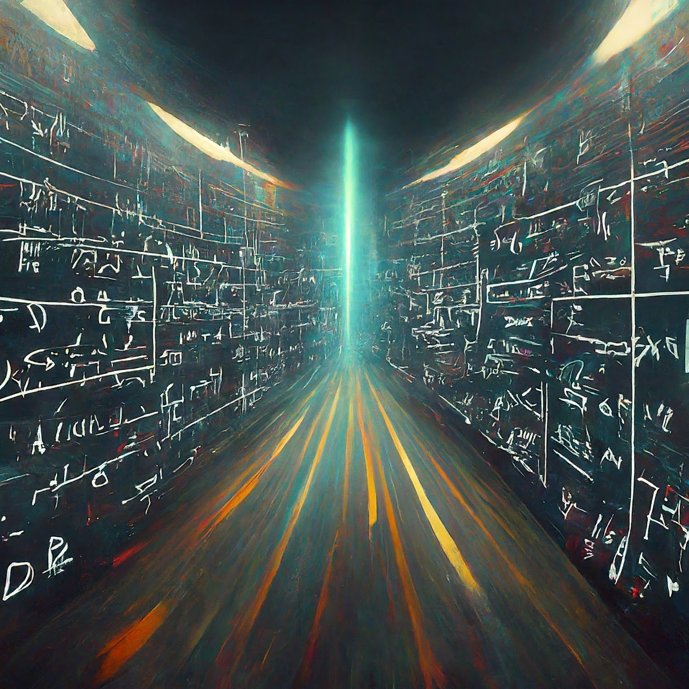

<!-- theme: default -->
<!-- auto-scaling: true -->

# What is Data Science and why would you care about Mathematics as a data scientist?
Julien Arino ([julien.arino@umanitoba.ca](mailto:julien.arino@umanitoba.ca))

Department of Mathematics
University of Manitoba

---

# In days of yore (circa 2010)

> Big data is like teenage sex: everyone talks about it, nobody really knows how to do it, everyone thinks everyone else is doing it, so everyone claims they are doing it...

Attributed to [Dan Ariely](https://twitter.com/danariely/status/287952257926971392?lang=en) (Duke University)

The vocabulary has evolved, big data $\to$ complex data $\to$ data science, but Data Science remains a loosely defined concept, although things are becoming better

---

# Data Science (according to Wikipedia)

Data science is an **interdisciplinary field** that uses scientific methods, processes, algorithms and systems to extract knowledge and insights from **structured** and **unstructured data**, and apply knowledge and actionable insights from data across a broad range of application domains.

[..] It uses techniques and theories drawn from many fields within the context of **mathematics**, **statistics**, **computer science**, **information science**, and **domain knowledge**.

---

# The data deluge

- Data science is nothing new (some statisticians argue it is just another name for statistics), but it has become prominent in recent years as a consequence of the unprecedented mass of information generated and collected by our modern societies
- One speaks of *information explosion* or *data deluge*. See some considerations, e.g., [here](https://bernardmarr.com/how-much-data-is-there-in-the-world/)

---

# A wide variety of jobs

We have absolutely insane amounts of data and we try to make sense of it

$\implies$ data science

However, except for the name, the situation has not improved significantly since the days of yore of Ariely's quote: data science is a hodge-podge that contains everything but the kitchen sink

To caricature
- two main types of data: structured and unstructured
- two main branches: statistics and computer science
- two main types of jobs: users and developpers 

---

# *Math* of Data Science?

Recall I said
- two main branches: statistics and computer science
- two main types of jobs: users and developpers 

So why a course on Math of Data Science?

If you plan to be a user and are not curious about *the how* and *the why* and can tolerate errors due to misuse of methods, then you probably don't care about this course

In other cases, many of the concepts used have their roots in math and to understand where the methods are coming from and, even more importantly, to develop new methods, math is often required

---

# Warning!

We barely brush the surface here:

- Some techniques from linear algebra
- Some graph theory ideas
- A little bit of multivariable calculus

There is a lot more to see!!!

---

# Prerequisites / What you will learn

- (MATH 1210 or MATH 1220 or MATH 1300) and (MATH 1232 or MATH 1700 or MATH 1710)

- $\Rightarrow$ I expect you to **know and be comfortable** with 1st year linear algebra (3 CH) and 1st year calculus (6 CH)

- We need more: some stuff you would learn in 2090 (Linear Algebra 2), some stuff from 2130, 2150 or 2720 (Multivariable Calculus) and some stuff from 2070 (Graph Theory)

---

# Focus here is not on mathematical precision

- We won't do complicated proofs. I will show some when they are useful in understanding *why* something works
- We will cover just enough of the mentioned math topics that you can understand *how* to do things
- In classic math courses, we work on "small" examples so we can work them by hand (and students are able to do them in tests). Here, you will do small examples by hand, indeed, in assignments and tutorials to understand how things work. But you will do regularly sized examples in computer assignments
- We'll even do small examples on computers